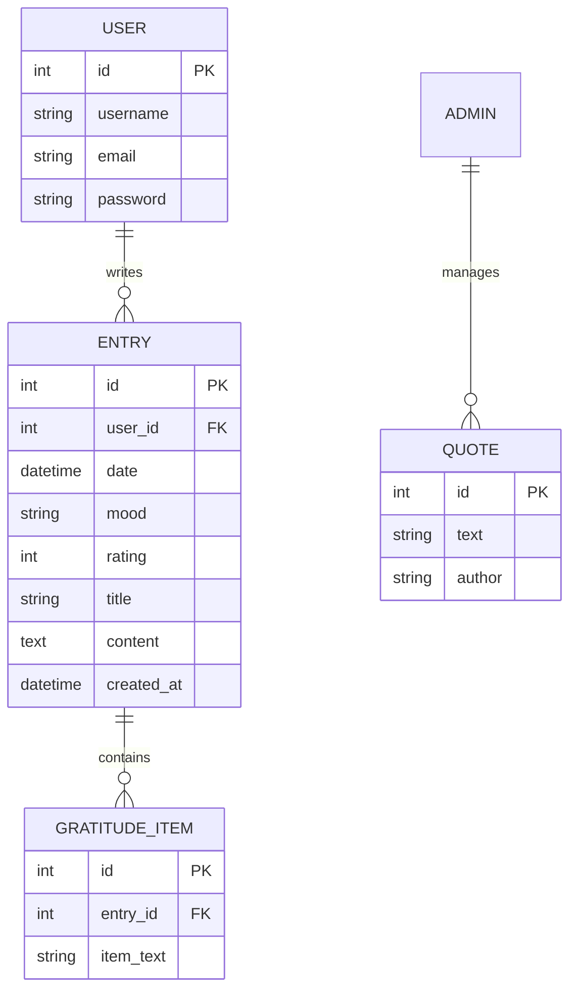

## Demystified Journal

A journal Web application developer using Django

---
## Table of Contents

---

# Purpose of project

# User Experience Design

## Typography and Fonts used

## Color Palette

# Wireframes

## Mobile Wireframes

## Tablet Wireframes

## Desktop Wireframes

# User Stories

# Features

# Entity Relationship Diagram (ERD)

# Testing

# Bugs

# Deployment

# Technologies used

# Development Process
