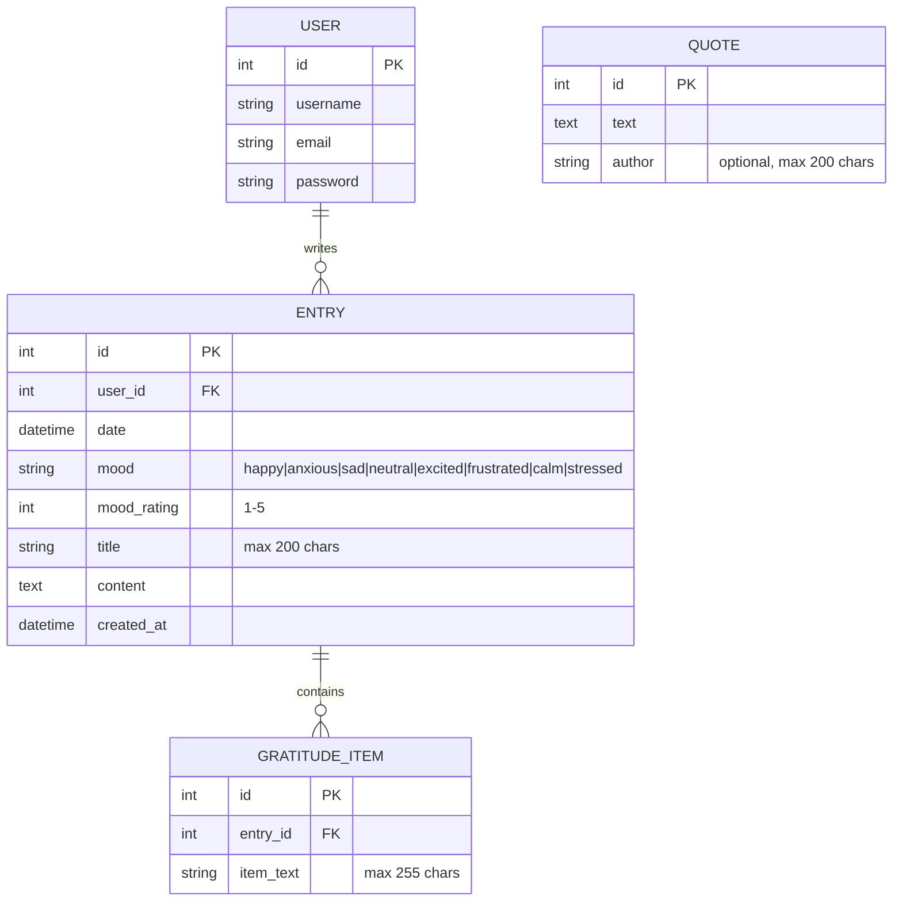

# MoodJournal

A personal mood and gratitude journaling web application built with Django. Users can record daily journal entries, track their mood, rate their day, and list things they are grateful for — all in a calm, distraction-free interface.

---

## Table of Contents

- [MoodJournal](#moodjournal)
  - [Table of Contents](#table-of-contents)
- [Purpose of project](#purpose-of-project)
- [User Experience Design](#user-experience-design)
  - [Typography and Fonts used](#typography-and-fonts-used)
  - [Color Palette](#color-palette)
- [Wireframes](#wireframes)
  - [Mobile Wireframes](#mobile-wireframes)
  - [Tablet Wireframes](#tablet-wireframes)
  - [Desktop Wireframes](#desktop-wireframes)
- [User Stories](#user-stories)
- [Features](#features)
- [Entity Relationship Diagram (ERD)](#entity-relationship-diagram-erd)
- [Testing](#testing)
- [Bugs](#bugs)
- [Deployment](#deployment)
- [Technologies used](#technologies-used)
- [Development Process](#development-process)

---

# Purpose of project

MoodJournal provides a simple, private space for daily reflection. The application encourages users to name their mood, rate their day on a 1–5 scale, write a freeform journal entry, and optionally list up to three things they are grateful for. Over time these entries build a personal record of emotional patterns and positive moments. The home page surfaces a random inspirational quote to set a calm tone before writing.

---

# User Experience Design

## Typography and Fonts used

The application uses **Montserrat** from Google Fonts as the primary typeface, with `Inter`, `Segoe UI`, and `system-ui` as fallbacks. Montserrat was chosen for its clean geometric style which suits a calm, minimal journaling interface. The font is loaded via a `<link rel="preload">` tag to minimise layout shift.

## Color Palette
The UI is themed using the Catppuccin Latte palette — a warm, low‑contrast light theme for calm reflection. Additional accents used across the app (homepage, edit actions, form surfaces, muted text, and focus states) are listed below.


| Role                    | Name      | Hex       |
| ----------------------- | --------- | --------- |
| Primary / links         | Blue      | `#1e66f5` |
| Brand / logo            | Mauve     | `#8839ef` |
| Link hover              | Lavender  | `#7287fd` |
| Homepage accent         | Rosewater | `#f5e0dc` |
| Edit / action buttons   | Peach     | `#f5a97f` |
| Success                 | Green     | `#40a02b` |
| Danger                  | Red       | `#d20f39` |
| Warning                 | Yellow    | `#df8e1d` |
| Info / secondary        | Sky       | `#89b4fa` |
| Body text               | Text      | `#4c4f69` |
| Muted / secondary text  | Subtext0  | `#6c6f85` |
| Navbar background       | Mantle    | `#e6e9ef` |
| Card / border           | Surface 0 | `#ccd0da` |
| Form / input background | Surface 1 | `#e9edf2` |
| Overlay / focus state   | Overlay 0 | `#b6bac6` |
| Page background         | Base      | `#ffffff` |

---

# Wireframes

## Mobile Wireframes

## Tablet Wireframes

## Desktop Wireframes

---

# User Stories

| #   | As a…   | I want to…                                                              | So that…                                            |
| --- | ------- | ----------------------------------------------------------------------- | --------------------------------------------------- |
| 1   | Visitor | Register for an account                                                 | I can start keeping a private journal               |
| 2   | Visitor | Sign in to my account                                                   | I can access my existing entries                    |
| 3   | User    | Create a new journal entry with a title, mood, mood rating, and content | I can record how I am feeling each day              |
| 4   | User    | Add up to 3 optional gratitude items to an entry                        | I can reflect on positive moments alongside my mood |
| 5   | User    | View a paginated list of all my past entries                            | I can browse my journal history                     |
| 6   | User    | Search my entries by title, content, mood, or gratitude text            | I can quickly find a specific entry                 |
| 7   | User    | View the full detail of a single entry                                  | I can re-read what I wrote                          |
| 8   | User    | Edit an existing entry and its gratitude items                          | I can correct or update my record                   |
| 9   | User    | Delete an entry after confirming                                        | I can remove entries I no longer want to keep       |
| 10  | User    | See a random inspirational quote on the home page                       | I feel encouraged before I start writing            |
| 11  | User    | Sign out securely                                                       | My journal remains private                          |

---

# Features

- **Home page** — Hero section with a daily reflection prompt and a randomly selected inspirational quote.
- **User authentication** — Registration, login, and logout powered by `django-allauth`. All entry views require login; users can only access their own data.
- **Create entry** — Form with date/time picker, mood selector (8 choices), 1–5 mood rating, title, freeform content, and an optional inline formset for up to 3 gratitude items. Entry and gratitude items are saved inside a database transaction so no orphaned data is created on validation failure.
- **Entry list** — Paginated (10 per page) card grid of all entries sorted by date descending, with a responsive search bar filtering across title, content, mood, and gratitude text.
- **Entry detail** — Full view of a single entry including all gratitude items.
- **Edit entry** — Pre-populated form to update any field and manage existing gratitude items.
- **Delete entry** — Confirmation page before permanent deletion, with a dismissible modal for inline deletion from the list view.
- **Toast notifications** — Auto-dismissing Bootstrap toast messages confirm successful create, update, and delete actions, and highlight validation errors.
- **Responsive layout** — Bootstrap 5 grid with separate mobile and desktop layouts for the entry list header and navigation.

---

# Entity Relationship Diagram (ERD)


```mermaid
erDiagram
    USER ||--o{ ENTRY : "writes"
    ENTRY ||--o{ GRATITUDE_ITEM : "contains"

    USER {
        int id PK
        string username
        string email
        string password
    }

    ENTRY {
        int id PK
        int user_id FK
        datetime date
        string mood "happy|anxious|sad|neutral|excited|frustrated|calm|stressed"
        int mood_rating "1-5"
        string title "max 200 chars"
        text content
        datetime created_at
    }

    GRATITUDE_ITEM {
        int id PK
        int entry_id FK
        string item_text "max 255 chars"
    }

    QUOTE {
        int id PK
        text text
        string author "optional, max 200 chars"
    }
```

# Testing

Automated tests are located in `journal/tests/` and cover:

| File             | What is tested                                                                                                                                                                     |
| ---------------- | ---------------------------------------------------------------------------------------------------------------------------------------------------------------------------------- |
| `test_models.py` | Model field validation, `__str__` methods, and DB-level CHECK constraints                                                                                                          |
| `test_forms.py`  | `EntryForm` and `GratitudeItemForm` field validation, blank/whitespace-only inputs                                                                                                 |
| `test_views.py`  | All views: authentication redirects, authorisation (users cannot access other users' entries), GET/POST happy paths, validation failure behaviour, success messages, and redirects |

Tests are run with **pytest-django**. Integration tests use **testcontainers** to spin up a real PostgreSQL instance so that database-level constraints are exercised. Run the full suite with:

```bash
pytest
```

# Bugs

# Deployment

The application is deployed to **Heroku** using the following setup:

- `Procfile` declares a `web` dyno using **Gunicorn** and runs database migrations on every release:
  ```
  web: gunicorn MoodJournal.wsgi
  release: python manage.py migrate
  ```
- Static files are served by **Whitenoise** without a separate CDN.
- The database is **PostgreSQL**, connected via the `DATABASE_URL` environment variable using `dj-database-url`.
- Sensitive settings (`SECRET_KEY`, `DEBUG`, `DATABASE_URL`) are stored as Heroku config vars and loaded from `env.py` locally.

To deploy from scratch:

```bash
heroku create
heroku addons:create heroku-postgresql:essential-0
heroku config:set SECRET_KEY=<your-secret-key> DEBUG=False
git push heroku main
```

# Technologies used

| Technology                              | Purpose                                                  |
| --------------------------------------- | -------------------------------------------------------- |
| Python 3                                | Core language                                            |
| Django 4.2                              | Web framework — models, views, forms, ORM                |
| PostgreSQL                              | Production database                                      |
| django-allauth 0.57                     | User authentication (registration, login, logout)        |
| django-crispy-forms + crispy-bootstrap5 | Form rendering with Bootstrap 5 styling                  |
| Gunicorn                                | WSGI server for production                               |
| Whitenoise                              | Static file serving                                      |
| dj-database-url                         | Parse `DATABASE_URL` environment variable                |
| Bootstrap 5.3                           | Frontend CSS framework                                   |
| Font Awesome 6                          | Icon library                                             |
| Montserrat (Google Fonts)               | Primary typeface                                         |
| Catppuccin Latte                        | Colour palette / CSS theme                               |
| pytest + pytest-django                  | Test runner                                              |
| testcontainers                          | Spin up real PostgreSQL container for integration tests  |
| python-dotenv                           | Load `.env` / `env.py` locally                           |
| Docker                                  | Required by testcontainers for local integration testing |

# Development Process
