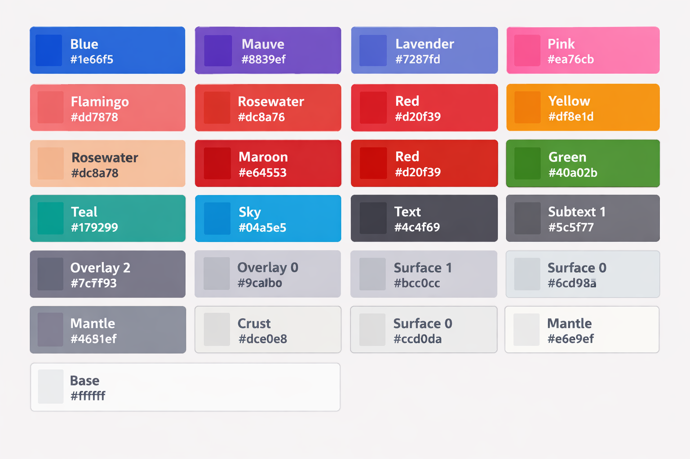
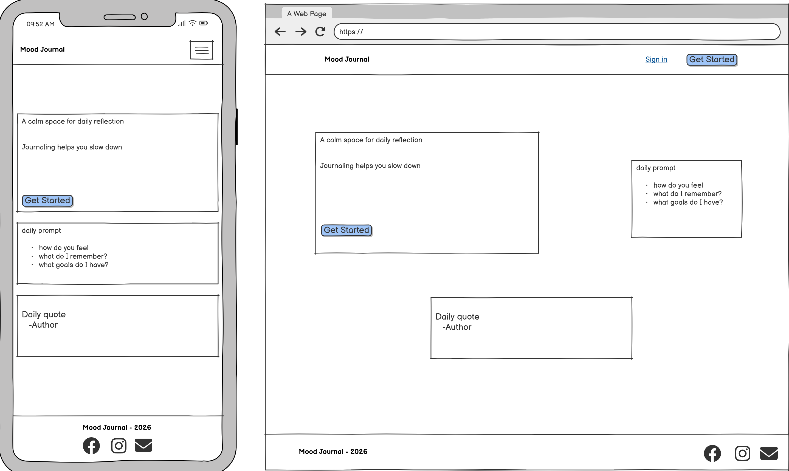
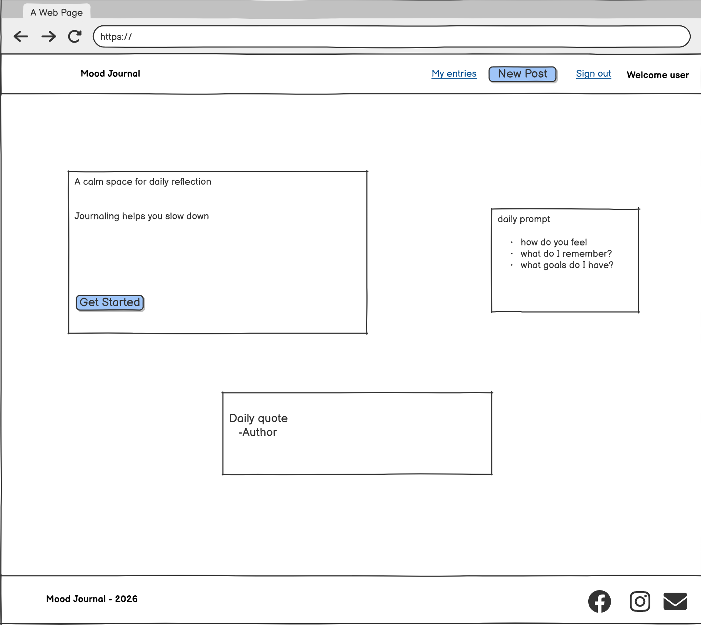
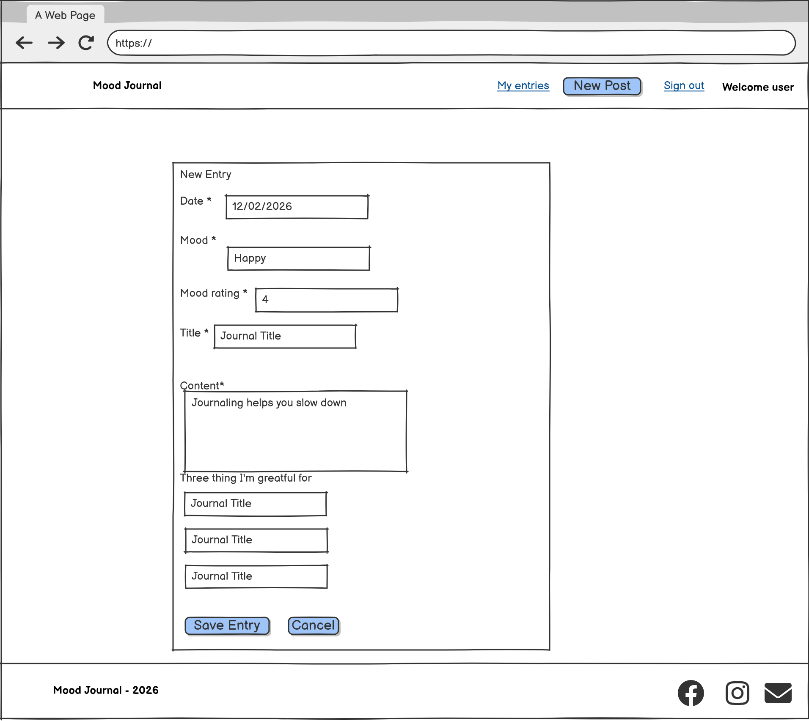
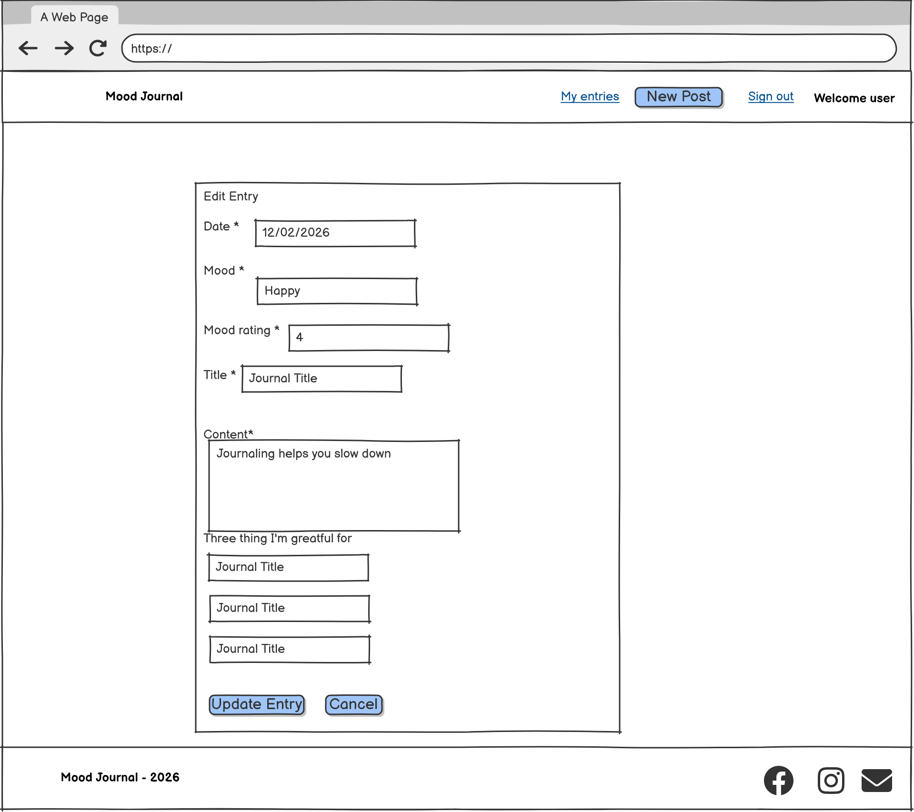
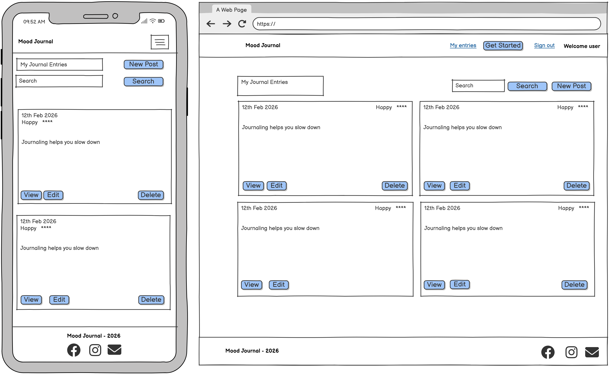
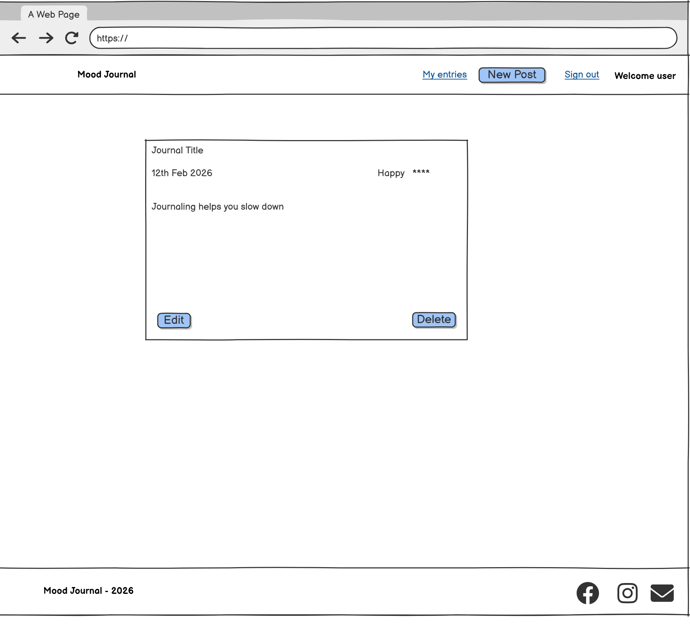
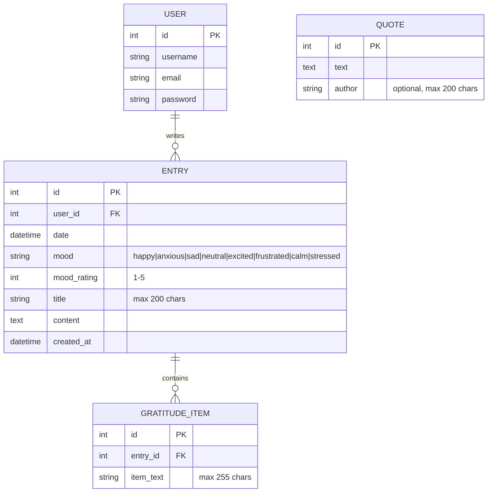

# MoodJournal

A personal mood and gratitude journaling web application built with Django. Users can record daily journal entries, track their mood, rate their day, and list things they are grateful for — all in a calm, distraction-free interface.

---

# Table of Contents

- [MoodJournal](#moodjournal)
- [Table of Contents](#table-of-contents)
- [Purpose of project](#purpose-of-project)
- [User Experience Design](#user-experience-design)
  - [Typography and Fonts used](#typography-and-fonts-used)
  - [Color Palette](#color-palette)
- [Wireframes](#wireframes)
- [User Stories](#user-stories)
  - [Must Have](#must-have)
  - [Should Have](#should-have)
  - [Could Have](#could-have)
- [Entity Relationship Diagram (ERD)](#entity-relationship-diagram-erd)
- [Testing](#testing)
- [Bugs](#bugs)
- [Deployment](#deployment)
- [Technologies used](#technologies-used)
  - [Backend](#backend)
  - [Frontend](#frontend)
  - [Testing \& Development](#testing--development)
  - [Deployment \& Infrastructure](#deployment--infrastructure)
- [Development Process](#development-process)

---

# Purpose of project

MoodJournal provides a simple, private space for daily reflection. The application encourages users to name their mood, rate their day on a 1–5 scale, write a freeform journal entry, and optionally list up to three things they are grateful for. Over time these entries build a personal record of emotional patterns and positive moments. The home page surfaces a random inspirational quote to set a calm tone before writing.

---

# User Experience Design

## Typography and Fonts used

The application uses **Montserrat** from Google Fonts as the primary typeface, with `Inter`, `Segoe UI`, and `system-ui` as fallbacks. Montserrat was chosen for its clean geometric style which suits a calm, minimal journaling interface. The font is loaded via a `<link rel="preload">` tag to minimise layout shift.

## Color Palette
The UI is themed using the Catppuccin Latte palette — a warm, low‑contrast light theme for calm reflection. Every colour used across the app (links, navigation, buttons, mood badges, alerts, focus states, and surfaces) is listed below.



| Role                        | Name      | Hex       |
| --------------------------- | --------- | --------- |
| Primary / links             | Blue      | `#1e66f5` |
| Brand / logo                | Mauve     | `#8839ef` |
| Link hover / focus rings    | Lavender  | `#7287fd` |
| Navbar / footer gradient    | Pink      | `#ea76cb` |
| Navbar / footer gradient    | Flamingo  | `#dd7878` |
| View buttons / card accent  | Rosewater | `#dc8a78` |
| Danger buttons              | Maroon    | `#e64553` |
| Danger hover                | Red       | `#d20f39` |
| Excited mood badge          | Peach     | `#fe640b` |
| Warning / mood rating       | Yellow    | `#df8e1d` |
| Success / gratitude markers | Green     | `#40a02b` |
| Info / calm mood            | Teal      | `#179299` |
| Nav active / action button  | Sky       | `#04a5e5` |
| Body text                   | Text      | `#4c4f69` |
| Labels / secondary text     | Subtext 1 | `#5c5f77` |
| Muted / footer text         | Subtext 0 | `#6c6f85` |
| Secondary buttons           | Overlay 2 | `#7c7f93` |
| Neutral mood badge          | Overlay 1 | `#8c8fa1` |
| Placeholders / disabled     | Overlay 0 | `#9ca0b0` |
| Outline button borders      | Surface 1 | `#bcc0cc` |
| Borders / dividers          | Surface 0 | `#ccd0da` |
| Light backgrounds           | Mantle    | `#e6e9ef` |
| Utility background          | Crust     | `#dce0e8` |
| Page background             | Base      | `#ffffff` |

---

# Wireframes



*Public home (logged-out): calming quote and clear sign‑in / sign‑up actions.*



*Authenticated dashboard: quick-create, recent entries, and personalised greeting.*



*Create entry form (mobile/tablet): mood selector, rating, title, content, and up to 3 gratitude items.*



*Edit entry form with fields pre-filled and save / cancel actions.*



*Entry list view showing mood, rating, full content, date, and gratitude items.*



*Entry detail view: full entry with mood badge, rating, content, and gratitude items.*

---


# User Stories

For the project I have broken down the desired features into user stories, these consist of “As a **role**, I want **goal**, so that **benefit**”, this makes it easy to write clear acceptance criteria and break each story down into concrete implementation tasks. You can view the full [project board](https://github.com/users/iain-kirkham/projects/10) and development tasks in the projects tab.

## Must Have

1. User registration
    As a visitor, I want to register with a username and password so that I can create my own journals.

    Acceptance Criteria:
    - Form requires unique username and valid email (optional) format.
    - Passwords must be validated for security.
    - Successful registration automatically logs the user in or redirects to dashboard.

2. User login
    As a registered user, I want to login to my account so that I can access my journal entries.

    Acceptance Criteria:
    - Secure authentication via Allauth.
    - Error messages appear for invalid credentials.

3. User logout
    As a logged in user, I want to log out so that my data remains private on shared devices.

    Acceptance Criteria:
    - Session is destroyed on logout.
    - The user is redirected to the homepage.

4. Conditional navigation bar
    As a user, I want to see a dynamic menu so that I know if I am logged in or out.

    Acceptance Criteria:
    - Authenticated: show "New Entry", "My Entries", "Logout".
    - Not logged in: show "Login", "Register".

5. Create journal entry
    As a user, I want to create an entry with date, mood, mood rating, title, and content so that I can track my mental wellness.

    Acceptance Criteria:
    - Title text field.
    - Mood selection.
    - Rating scale (1-5).
    - Content text field.

6. Gratitude items
    As a user, I want optionally add up to three gratitude items to an entry so that I can practice gratitude and positivity.

    Acceptance Criteria:
    - Gratitude items are linked to a specific Entry ID.

7. Paginated entry list
    As a user, I want to see a list of my entries so that I can review my journal history.

    Acceptance Criteria:
    - Entries are paginated to 10 per page.
    - Next and previous page links when entries are over 10.

8. Detailed entry view
    As a user, I want to see the full details of an entry so that I can read my past reflections.

    Acceptance Criteria:
    - Shows all fields with the list of gratitude items.

9. Edit entry
    As a user, I want to edit an existing entry so that I can update my journal if I made a mistake or need to backdate.

    Acceptance Criteria:
    - User can change any field of their own entries.

10. Random inspirational quote
    As a user, I want to see a random quote on the homepage so that I feel motivated.

    Acceptance Criteria:
    - A new quote is displayed every time the dashboard is loaded.
    - The author is displayed alongside the text.

11. Responsive design
    As a user, I want a mobile-friendly site so that I can journal on the go.

    Acceptance Criteria:
    - Nav bar collapses into a hamburger menu on mobile.
    - Form fields take up full width on small screens.

12. Data privacy
    As a user, I want to only see my own entries so that my journal is private.

    Acceptance Criteria:
    - Users cannot view an Entry if it belongs to another user (returns 404).

13. Django admin management
    As an admin, I want to use the Django Admin panel so that I can manage users and quotes.

    Acceptance Criteria:
    - Admin can create, read, update, and delete (CRUD) all quotes and entries.
    - Entries are searchable in the admin panel by user.

## Should Have

1. Delete entry with confirmation
    As a user, I want to delete an entry with confirmation so that I can remove unwanted content safely.

    Acceptance Criteria:
    - User is able to delete an Entry with a button.
    - Requires a "Confirm Delete" step.
    - User gets successful delete confirmation.

2. Keyword search
    As a user, I want to search by title, content, mood, or gratitude items so that I can find specific memories or track trends.

    Acceptance Criteria:
    - Search bar is present on the entry list page.
    - Results update upon search to show matching entries.

3. Notifications
    As a user, I want success/error messages so that I know my data saved correctly.

    Acceptance Criteria:
    - Display messages appear after saving, editing, or deleting an entry.
    - Messages are color-coded (Green for success, Red for error).

4. Backdating journal entries
    As a user, I want to select a date in the past for my entry so that I can catch up on days I forgot to journal.

    Acceptance Criteria:
    - The "Date" field in the form allows for manual selection (Datepicker).
    - Defaults to "Today" but remains editable.

5. Password reset
    As a user, I want to reset my password via email if I forget it so that I don't lose access to my private journal.

    Acceptance Criteria:
    - "Forgot Password" link on the login page.
    - User receives a secure token link via email.

6. Edit journal entry modal
    As a user, I want to open and submit an edit form within a modal overlay, so that I can update my entries without losing my place in the list view or waiting for a full page reload.

    Acceptance Criteria:
    - Clicking the "Edit" button on a note card launches a Bootstrap modal.
    - Submitting the form updates the database and reflects the changes on the main list view immediately.
    - The modal closes automatically upon a successful save.
    - Validation errors (e.g. missing required fields) are displayed inside the modal without closing the overlay.
    - The background scroll position is preserved after the modal is closed.

## Could Have

1. Filtering
    As a user, I want to filter by mood or date range so that I can see patterns in my data.

    Acceptance Criteria:
    - Dropdown menu allows selection of one of the mood types.
    - Date pickers allow selecting a "Start" and "End" date.
    - Filters can be combined (e.g. "Sad" entries from "last week").

2. Mood charts
    As a user, I want mood calendars and charts so that I can see emotional trends.

    Acceptance Criteria:
    - Dashboard displays a line chart of mood ratings over the last 30 days.

3. Dark mode
    As a user, I want a dark mode toggle so that I can journal comfortably at night.

    Acceptance Criteria:
    - A toggle switch in the navbar or profile page.
    - Selection is saved to the user's session or profile model.

4. Export journal data
    As a user, I want to export my entries to a CSV file so that I have a permanent backup of my reflections.

    Acceptance Criteria:
    - A "Download CSV" button exists on the profile or list page.
    - The file includes Date, Title, Mood, Content and Gratitude items.
    - Only the user's own data is exported.

5. Toast notifications for user feedback
    As a user, I want to see unobtrusive toast notifications for actions like saving or deleting so that I get immediate feedback without breaking my visual flow.

    Acceptance Criteria:
    - Toasts appear in a consistent corner of the screen (e.g., top-right).
    - Toasts are color-coded: Success (Green), Error (Red), Info (Blue).
    - Toasts automatically disappear after 3–5 seconds or can be dismissed manually.
    - The system handles multiple toasts if actions happen in quick succession.

---

# Entity Relationship Diagram (ERD)

The ERD below shows the data model I have created for this project,  a `USER` writes many `ENTRY` records (one-to-many). Each `ENTRY` may optionally contain zero or more `GRATITUDE_ITEM` records (one-to-many), and `QUOTE` is a standalone entity used for the homepage. Key constraints (mood types, mood rating range, and entry ownership) are enforced at both the application and database level to protect data integrity and privacy.


```mermaid
erDiagram
    USER ||--o{ ENTRY : "writes"
    ENTRY ||--o{ GRATITUDE_ITEM : "contains"

    USER {
        int id PK
        string username
        string email
        string password
    }

    ENTRY {
        int id PK
        int user_id FK
        datetime date
        string mood "happy|anxious|sad|neutral|excited|frustrated|calm|stressed"
        int mood_rating "1-5"
        string title "max 200 chars"
        text content
        datetime created_at
    }

    GRATITUDE_ITEM {
        int id PK
        int entry_id FK
        string item_text "max 255 chars"
    }

    QUOTE {
        int id PK
        text text
        string author "optional, max 200 chars"
    }
```


# Testing

See `TESTING.md` for full instructions on running the automated test suite (Django test runner, `testcontainers`, Docker usage, and CI notes). The project also includes manual testing — HTML validation, CSS checks, WAVE accessibility scans, Lighthouse audits, and user-story walkthroughs — to help ensure markup quality, visual consistency, accessibility, and real-world behaviour across browsers and viewports.

Run the full test suite locally with:

```bash
python manage.py test
```

# Bugs

# Deployment

The application is deployed to **Heroku** using the following setup:

- `Procfile` declares a `web` dyno using **Gunicorn** and runs database migrations on every release:
  ```
  web: gunicorn MoodJournal.wsgi
  release: python manage.py migrate
  ```
- Static files are served by **Whitenoise** without a separate CDN.
- The database is **PostgreSQL**, connected via the `DATABASE_URL` environment variable using `dj-database-url`.
- Sensitive settings (`SECRET_KEY`, `DEBUG`, `DATABASE_URL`) are stored as Heroku config vars and loaded from `env.py` locally.

To deploy from scratch:

```bash
heroku create
heroku addons:create heroku-postgresql:essential-0
heroku config:set SECRET_KEY=<your-secret-key> DEBUG=False
git push heroku main
```

# Technologies used

## Backend

- Python 3.12 - Core language
- Django 4.2 - Web framework (models, views, forms, ORM)
- PostgreSQL - Production database
- dj-database-url - Parse DATABASE_URL environment variable
- python-dotenv - Load local environment variables

## Frontend

- Bootstrap 5.3 - CSS framework and responsive layout
- Font Awesome 7 - Icon library
- Montserrat (Google Fonts) - Primary typeface
- Catppuccin Latte - Colour palette / CSS theme
- django-crispy-forms + crispy-bootstrap5 - Server-side form rendering with Bootstrap styling

## Testing & Development

- testcontainers - Run integration tests with real PostgreSQL containers
- Docker - Runtime required by `testcontainers` for integration tests, also used to run a local PostgreSQL database during development

## Deployment & Infrastructure

- Gunicorn - WSGI server for production
- Whitenoise - Static file serving in production
- Heroku  - Deployment target; `DATABASE_URL`/config vars used in production

# Development Process
